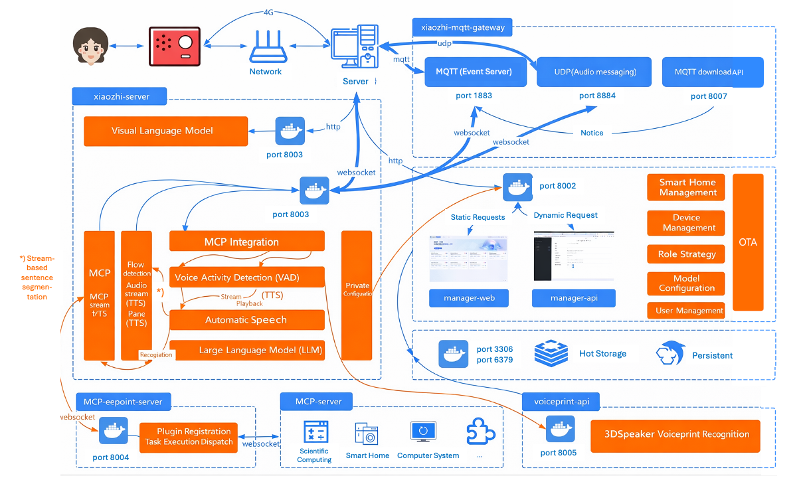

# Deployment of Full-Module Installation



# Method 1: Run All Modules with Docker

> Notice:
> Starting from version **0.8.2**, the Docker images released for this project only support **x64** architecture. If you need to deploy on an **arm64** CPU, you need to follow [the Docker build tutorial](./docker-build_en.md) to compile an arm64 image on your own machine.

## 1. Install Docker

If Docker is not yet installed on your machine, you can follow the guide [Docker Engine installation](https://docs.docker.com/engine/install/) to install it.

There are two ways to install the full‑module with Docker; 
1. You can use the [easy script](#1-1-easy-script) below (developed by [@VanillaNahida](https://github.com/VanillaNahida)). The script automatically downloads the required files and configurations.

2. You can alternatively use the [manual deployment method](#1-2-manual-deployment) below to set up everything from scratch.

### 1.1 Easy Script (for Docker on x64 Ubuntu only)  

> Notice:
> Currently this simplified deployment is only supported on **Ubuntu server**; other systems have not been tested and may exhibit unexpected bugs.

Deployment is simple; a video tutorial is available [here](https://www.bilibili.com/video/BV17bbvzHExd/). 

The deployment steps are as follows:

* Use an SSH client to connect to the server and run the following as **root**:

```bash
sudo bash -c "$(wget -qO- https://ghfast.top/https://raw.githubusercontent.com/xinnan-tech/xiaozhi-esp32-server/main/docker-setup.sh)"
```

	This script will automatically perform the following steps:
	1. Install Docker  
	2. Configure the image sources  
	3. Download/pull images  
	4. Download the speech‑recognition model files  
	5. Guide you through server configuration  

* After the script finishes, complete the simple configuration and then refer to sections [Run the Program](#4--run-the-program) and [Restart xiaozhi-esp32-server](#5--restart-xiaozhi-esp32-server) below to finish the three critical configurations.

### 1.2 Manual Deployment  

#### 1.2.1 Create the Directories  

After Docker is installed, create a directory for the project, e.g., `xiaozhi-server`.

Inside `xiaozhi-server` create a `data` folder and a `models` folder; inside `models` create a `SenseVoiceSmall` sub‑folder.

The final directory structure should look like this:

```
xiaozhi-server
  ├─ data
  ├─ models
     ├─ SenseVoiceSmall
```

#### 1.2.2 Download the Speech‑Recognition Model  

The project uses the **SenseVoiceSmall** model for speech‑to‑text. Because the model is large, it must be downloaded separately; place the downloaded `model.pt` into `models/SenseVoiceSmall`.

You can get it via:
- [Download from ModelScope](https://modelscope.cn/models/iic/SenseVoiceSmall/resolve/master/model.pt)
- [Download from Baidu Netdisk ](https://pan.baidu.com/share/init?surl=QlgM58FHhYv1tFnUT_A8Sg&pwd=qvna) (Extraction code: `qvna`)

#### 1.2.3 Download the Configuration Files  

You need to download two configuration files `docker-compose_all.yaml` and `config_from_api.yaml` from this repository.

* Download `docker-compose_all.yaml`:

```bash
wget https://raw.githubusercontent.com/xinnan-tech/xiaozhi-esp32-server/refs/heads/main/main/xiaozhi-server/docker-compose_all.yml
```

* Download `config_from_api.yaml`

```bash
wget https://raw.githubusercontent.com/xinnan-tech/xiaozhi-esp32-server/refs/heads/main/main/xiaozhi-server/config_from_api.yaml
mv config_from_api.yaml .config.yaml
```

* After downloading, verify that the directory now contains:

```
xiaozhi-server
  ├─ docker-compose_all.yml
  ├─ data
    ├─ .config.yaml
  ├─ models
     ├─ SenseVoiceSmall
       ├─ model.pt
```

* If your layout matches the above, continue. Otherwise, double‑check that you haven’t missed any steps.

---

## 2. Backup Your Data  

If you have previously run the smart‑control panel and stored important data (e.g., keys), back it up before upgrading, as the upgrade may overwrite existing data.

---

## 3. Clean Up Historical Images and Containers  

Open a terminal or command‑line tool in the `xiaozhi-server` directory and execute:

```bash
docker compose -f docker-compose_all.yml down

docker stop xiaozhi-esp32-server && docker rm xiaozhi-esp32-server
docker stop xiaozhi-esp32-server-web && docker rm xiaozhi-esp32-server-web
docker stop xiaozhi-esp32-server-db && docker rm xiaozhi-esp32-server-db
docker stop xiaozhi-esp32-server-redis && docker rm xiaozhi-esp32-server-redis

docker rmi ghcr.nju.edu.cn/xinnan-tech/xiaozhi-esp32-server:server_latest
docker rmi ghcr.nju.edu.cn/xinnan-tech/xiaozhi-esp32-server:web_latest
```

---

## 4. Run the Program  

Start the new version containers:

```bash
docker compose -f docker-compose_all.yml up -d
```

Then tail the logs to verify the service started:

```bash
docker logs -f xiaozhi-esp32-server-web
```

You should eventually see output similar to:

```
2025-xx-xx 22:11:12.445 [main] INFO  c.a.d.s.b.a.DruidDataSourceAutoConfigure - Init DruidDataSource
2025-xx-xx 21:28:53.873 [main] INFO  xiaozhi.AdminApplication - Started AdminApplication in 16.057 seconds (process running for 17.941)
http://localhost:8002/xiaozhi/doc.html
```

At this point only the **smart‑control panel** is running. If the 8000‑port service (`xiaozhi-esp32-server`) reports an error, ignore it for now.

Open a browser and navigate to the smart‑control panel: `http://127.0.0.1:8002`. Register the first user; this user becomes the **super administrator**. Subsequent users are ordinary members who can only bind devices and configure agents; the super administrator can manage models, users, and parameters.

---

***Now perform the three critical steps:***

### First Critical Step  

1. Log in with the super‑admin account.  
2. In the top menu select **Parameter Management**.  
3. Find the first entry whose code is `server.secret` and copy its **value**.  

`server.secret` is important because it lets the **Server** connect to the `manager-api`. The secret is a random key generated each time the manager module is redeployed.

Open the `.config.yaml` file under `xiaozhi-server/data` and edit it to contain:

```
manager-api:
  url: http://xiaozhi-esp32-server-web:8002/xiaozhi
  secret: <your server.secret value here>
```

Replace the placeholder with the secret you copied.

---

### Second Critical Step  

1. Log in with the super‑admin account.  
2. In the top menu choose **Model Configuration**, then click **Large Language Models** on the left sidebar.  
3. Locate the first entry, **ZhiPu AI**, click **Edit**, paste your ZhiPu AI API key into the **API Key** field, and save.

\
*The third step follows after a necessary restart:*

---

## 5. Restart xiaozhi-esp32-server  

In the terminal run:

```bash
docker restart xiaozhi-esp32-server
docker logs -f xiaozhi-esp32-server
```

You should see logs indicating successful startup, e.g.:

```
25-02-23 12:01:09[core.websocket_server] - INFO - Websocket address is      ws://xxx.xx.xx.xx:8000/xiaozhi/v1/
25-02-23 12:01:09[core.websocket_server] - INFO - =======The above address is the websocket protocol address; do NOT open it in a browser=======
25-02-23 12:01:09[core.websocket_server] - INFO - To test the websocket, open test_page.html in the test directory with Google Chrome
25-02-23 12:01:09[core.websocket_server] - INFO - =======================================================
```

Because you are using a full‑module deployment, two important endpoints must be configured on your ESP‑32:

- **OTA interface**: `http://<host‑IP>:8002/xiaozhi/ota/`  
- **Websocket interface**: `ws://<host‑IP>:8000/xiaozhi/v1/`

---

### Third Critical Step  

1. Log in with the super‑admin account.  
2. In **Parameter Management**, find the entry with code `server.websocket` and set its value to the **Websocket interface** you just obtained.  
3. In **Parameter Management**, find the entry with code `server.ota` and set its value to the **OTA interface**.

Now you can start using your ESP‑32 device. You may either:

1. **Compile your own ESP‑32 firmware** – see the doc [firmware-build](firmware-build_en.md)
2. **Use the pre‑compiled firmware 1.6.1 or newer** provided by “Xiao Ge” – see the doc [firmware‑setting](firmware‑setting_en.md)

---

# Method 2: Run All Modules from the Sources  

## 1. Install MySQL  

If MySQL is already installed, create a database named `xiaozhi_esp32_server`:

```sql
CREATE DATABASE xiaozhi_esp32_server CHARACTER SET utf8mb4 COLLATE utf8mb4_unicode_ci;
```

If you need to install MySQL via Docker:

```bash
docker run --name xiaozhi-esp32-server-db -e MYSQL_ROOT_PASSWORD=123456 -p 3306:3306 \
  -e MYSQL_DATABASE=xiaozhi_esp32_server -e MYSQL_INITDB_ARGS="--character-set-server=utf8mb4 --collation-server=utf8mb4_unicode_ci" \
  -e TZ=Asia/Shanghai -d mysql:latest
```

## 2. Install Redis  

If Redis is not installed, run:

```bash
docker run --name xiaozhi-esp32-server-redis -d -p 6379:6379 redis
```

## 3. Run the Manager‑API Program  

### 3.1 Install JDK 21 and Maven  

Set the corresponding environment variables.

### 3.2 Set Up the Project in VS Code  

Open the `manager-api` module in VS Code, install the required Java plugins.

Edit `src/main/resources/application-dev.yml` to configure the database connection:

```yaml
spring:
  datasource:
    username: root
    password: 123456
```

Edit the same file to configure Redis:

```yaml
spring:
    data:
      redis:
        host: localhost
        port: 6379
        password:
        database: 0
```

### 3.3 Start the Application  

The project is a Spring Boot app; start it by running the `main` method of `Application.java`:

```
src/main/java/xiaozhi/AdminApplication.java
```

When you see logs such as:

```
2025-xx-xx 22:11:12.445 [main] INFO  c.a.d.s.b.a.DruidDataSourceAutoConfigure - Init DruidDataSource
2025-xx-xx 21:28:53.873 [main] INFO  xiaozhi.AdminApplication - Started AdminApplication in 16.057 seconds (process running for 17.941)
http://localhost:8002/xiaozhi/doc.html
```

the manager‑api service is up.

## 4. Run the Manager‑Web Program  

### 4.1 Install Node.js  

### 4.2 Open the manager‑web module in VS Code  

In the terminal, navigate to the `manager-web` directory and run:

```bash
npm install
npm run serve
```

If your manager‑api endpoint is not at `http://localhost:8002`, edit `main/manager-web/.env.development` accordingly.

After the server starts, open a browser and go to `http://127.0.0.1:8001`. Register the first user (who becomes the super administrator). The registration steps are identical to those described in the Docker deployment section.

> **Important** – After registration, use the super‑admin account to:
> 1. Open **Parameter Management**, locate the entry with code `server.secret`, and copy its value.  
> 2. Open **Model Configuration → Large Language Models**, find **ZhiPu AI**, click **Edit**, paste the API key, and save.

---

## 5. Install the Python Environment  

The project uses `conda` to manage dependencies. If you prefer not to use `conda`, install the required system libraries (`libopus`, `ffmpeg`) manually.

### Windows Users  

Install **Anaconda**, then search for “Anaconda Prompt” in the Start menu and run it as Administrator.

You should see a prompt that starts with `(base)`. That indicates you are inside a conda environment.

### Create and Activate the Environment  

```bash
conda remove -n xiaozhi-esp32-server --all -y
conda create -n xiaozhi-esp32-server python=3.10 -y
conda activate xiaozhi-esp32-server

# Add Tsinghua mirror
conda config --add channels https://mirrors.tuna.tsinghua.edu.cn/anaconda/pkgs/main
conda config --add channels https://mirrors.tuna.tsinghua.edu.cn/anaconda/pkgs/free
conda config --add channels https://mirrors.tuna.tsinghua.edu.cn/anaconda/cloud/conda-forge

conda install libopus -y
conda install ffmpeg -y

# On Linux, if you encounter a missing libiconv.so.2 error, install it with:
conda install libiconv -y
```

> **Note** – Execute each command sequentially and verify the output to ensure success at each step.

## 6. Install Project Dependencies  

Download the source code (e.g., via `git clone` or by downloading the ZIP from the GitHub page) and rename the root folder to `xiaozhi-esp32-server`. Then navigate to `main/xiaozhi-server`.

```bash
cd main/xiaozhi-server
pip config set global.index-url https://mirrors.aliyun.com/pypi/simple/
pip install -r requirements.txt
```

## 7. Download the Speech‑Recognition Model  

Download `model.pt` for **SenseVoiceSmall** and place it under `models/SenseVoiceSmall` (same options as in the Docker section).

## 8. Configure the Project  

1. Log in with the super‑admin account.  
2. In **Parameter Management**, locate the entry with code `server.secret` and copy its value.  
3. Edit `.config.yaml` under `xiaozhi-server/data`:

```yaml
manager-api:
  url: http://127.0.0.1:8002/xiaozhi
  secret: <your server.secret value>
```

Replace the placeholder with the copied secret value. The final file should look like:

```
manager-api:
  url: http://127.0.0.1:8002/xiaozhi
  secret: 12345678-xxxx-xxxx-xxxx-123456789000
```

## 9. Run the Project  

```bash
conda activate xiaozhi-esp32-server
python app.py
```

If you see logs similar to:

```
25-02-23 12:01:09[core.websocket_server] - INFO - Server is running at ws://xxx.xx.xx.xx:8000/xiaozhi/v1/
25-02-23 12:01:09[core.websocket_server] - INFO - =======The above address is the websocket protocol address; do NOT open it in a browser=======
25-02-23 12:01:09[core.websocket_server] - INFO - To test the websocket, open test_page.html in the test directory with Google Chrome
25-02-23 12:01:09[core.websocket_server] - INFO - =======================================================
```

the service has started successfully.

### Important Endpoints (for ESP‑32)

- **OTA endpoint**: `http://<your‑LAN‑IP>:8002/xiaozhi/ota/`
- **Websocket endpoint**: `ws://<your‑LAN‑IP>:8000/xiaozhi/v1/`

Configure them in the smart‑control panel:

1. Use the super‑admin account to set parameter code `server.websocket` to the websocket URL.  
2. Use the super‑admin account to set parameter code `server.ota` to the OTA URL.

Now you can control your ESP‑32, either by compiling your own firmware ([firmware-build.md]) or by flashing the pre‑compiled firmware (≥ 1.6.1) from “Xiao Ge” ([firmware‑setting.md]).

---

# FAQ (Frequently Asked Questions)  

1. [Why does the system output a lot of Korean, Japanese, or English text when I speak?]('./FAQ.md)  
2. [Why do I get “TTS task failed: file does not exist”?]('./FAQ.md)  
3. [TTS frequently fails and times out.]('./FAQ.md)  
4. [I can connect via Wi‑Fi to the self‑hosted server, but not over 4G.]('./FAQ.md)  
5. [How can I improve the response speed of the smart‑control panel?]('./FAQ.md)  
6. [I speak slowly; the system often interrupts me.]('./FAQ.md)  

# Deployment‑Related Guides  

1. [How to automatically pull the latest code, build, and restart the project]('./dev-ops-integration.md)  
2. [How to deploy an MQTT gateway that supports both MQTT and UDP protocols]('./mqtt-gateway-integration.md)  
3. [How to integrate with Nginx] (https://github.com/xinnan-tech/xiaozhi-esp32-server/issues/791)  

# Extension‑Related Guides  

1. [How to enable phone‑number registration for the smart‑control panel]('./ali-sms-integration.md)  
2. [How to integrate HomeAssistant for smart‑home control]('./homeassistant-integration.md)  
3. [How to enable a vision model for image recognition]('./mcp-vision-integration.md)  
4. [How to deploy an MCP endpoint]('./mcp-endpoint-enable.md)  
5. [How to use an MCP endpoint]('./mcp-endpoint-integration.md)  
6. [How to enable voice‑print recognition]('./voiceprint-integration.md)  
7. [How to configure a news plugin source]('./newsnow_plugin_config.md)  
8. [How to use the weather plugin]('./weather-integration.md)  

# Voice‑Cloning & Local‑Deployment Guides  

1. [How to clone a voice timbre in the smart‑control panel]('./huoshan-streamTTS-voice-cloning.md)  
2. [How to deploy the index‑tts local TTS engine]('./index-stream-integration.md)  
3. [How to deploy the fish‑speech local TTS engine]('./fish-speech-integration.md)  
4. [How to deploy PaddleSpeech locally]('./paddlespeech-deploy.md)  

# Performance‑Testing Guide  

1. [Component‑speed testing guide]('./performance_tester.md)  
2. [Publicly released test results] (https://github.com/xinnan-tech/xiaozhi-performance-research)  
