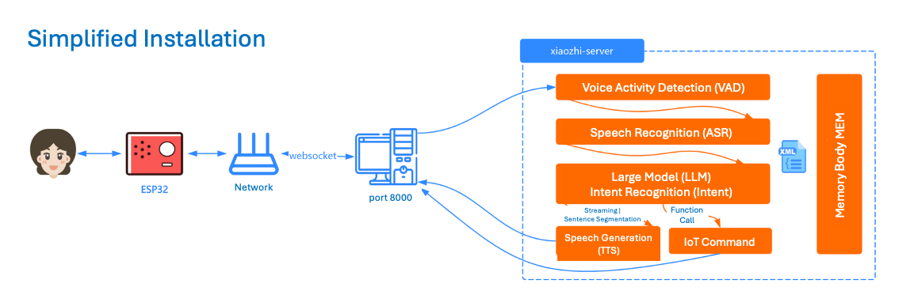

# Deployment of Simplified Installation

  

# Method 1: Run Server in Docker Only  

## 1. Install on Docker  

***This Chapter 1 is for x64-based Docker only.***

**If you need to deploy on an arm64 system**, you need to first follow the instruction in the [Guide For Container-Build/Deployment on arm64-Based Systems](deplpyment_arm64_docker_en.md). Then skip to chapter 2 for customizing your installation.

**The rest of chapter 1 assumes, that you are on a x64 system.**
You might need to install Docker on your system first, by e.g. following the tutorial: [Install Docker on Ubuntu](https://docs.docker.com/engine/install/ubuntu/).

### 1.1 Manual Deployment  

#### 1.1.1 Create a Directory  

After installing Docker, you need to create a directory to store the project configuration files, e.g., create a folder named `xiaozhi-server`.

Inside `xiaozhi-server` create two subfolders: `data` and `models`. Inside `models` create another folder called `SenseVoiceSmall`.

The final directory structure should look like this:

```
xiaozhi-server
  ├─ data
  ├─ models
     ├─ SenseVoiceSmall
```

#### 1.1.2 Download the Speech Recognition Model Files  

Because the project uses an offline speech‑recognition solution by default, you need to download the model files. You can download them using the method described in [Download Model Files](#download-model-files).

After the download completes, return to this tutorial.

#### 1.1.3 Download the Configuration Files  

You need to download two configuration files: `docker-compose.yaml` and `config.yaml`. Obtain them from the project repository.

##### 1.1.3.1 Download `docker-compose.yaml`  

1. Open the link to `docker-compose.yml`: `../main/xiaozhi-server/docker-compose.yml`.  
2. On the right side of the page you will see a **RAW** button. Next to it is a download icon; click it to download the `docker-compose.yml` file.  
3. Save the file into your `xiaozhi-server` folder.

After downloading, continue reading.

##### 1.1.3.2 Create `config.yaml`  

1. Open the link to `config.yaml`: `../main/xiaozhi-server/config.yaml`.  
2. Again locate the **RAW** button and click the download icon to save the file into the `xiaozhi-server` directory.  
3. Rename the downloaded file to `.config.yaml` and move it into the `data` subfolder.

Now the directory structure of `xiaozhi-server` should be:

```
xiaozhi-server
  ├─ docker-compose.yml
  ├─ data
    ├─ .config.yaml
  ├─ models
     ├─ SenseVoiceSmall
       ├─ model.pt
```

If your folder layout matches the above, continue. Otherwise, double‑check that you have performed every step.

## 2. Configure the Project Files  

Before the program can run, you must configure which model to use. See the tutorial at [Configuring the Project Files](#configure-project-files).

Once the configuration files are set up, return to this guide.

## 3. Run Docker Commands  

Open a terminal (or command prompt), navigate to the `xiaozhi-server` directory, and execute:

```bash
docker compose up -d
```

Then check the logs:

```bash
docker logs -f xiaozhi-esp32-server
```

Watch the log output to confirm whether the deployment succeeded. Refer to [Confirming the Running State](#confirm-running-state) for details.

## 5. Version Upgrade Procedure  

When you need to upgrade the version later, follow these steps:

5.1 **Backup the `.config.yaml` file** inside the `data` folder and copy the essential configurations into the new `.config.yaml`.  
> **Note:** New versions may introduce new configuration items that the old file does not have, so copy only the necessary keys and do **not** simply overwrite the entire file.

5.2 Execute the following commands:

```bash
docker stop xiaozhi-esp32-server
docker rm xiaozhi-esp32-server
docker stop xiaozhi-esp32-server-web
docker rm xiaozhi-esp32-server-web
docker rmi ghcr.nju.edu.cn/xinnan-tech/xiaozhi-esp32-server:server_latest
docker rmi ghcr.nju.edu.cn/xinnan-tech/xiaozhi-esp32-server:web_latest
```

5.3 Re‑deploy using Docker as described in the earlier steps.

# Method 2: Run Server Locally from Source Code  

## 1. Install Basic Environment  

The project uses `conda` to manage dependencies. If you prefer not to install `conda`, install `libopus` and `ffmpeg` according to your operating system. If you decide to use `conda`, continue with the commands below.

> **Important:** On Windows, install **Anaconda**. After installation, search for “Anaconda” in the Start menu and launch **Anaconda Prompt** with administrator rights (see image below).


You should see `(base)` at the beginning of the command line, indicating you are inside a conda environment.


Now run the following commands:

```bash
conda remove -n xiaozhi-esp32-server --all -y
conda create -n xiaozhi-esp32-server python=3.10 -y
conda activate xiaozhi-esp32-server

# Add the Tsinghua channel
conda config --add channels https://mirrors.tuna.tsinghua.edu.cn/anaconda/pkgs/main
conda config --add channels https://mirrors.tuna.tsinghua.edu.cn/anaconda/pkgs/free
conda config --add channels https://mirrors.tuna.tsinghua.edu.cn/anaconda/cloud/conda-forge

conda install libopus -y
conda install ffmpeg -y

# On Linux, if you encounter a missing libiconv.so.2 library, install it:
conda install libiconv -y
```

> **Note:** Each command must be executed sequentially; verify the output after each step to ensure success.

## 2. Install Project Dependencies  

1. Clone the project repository or download the source code.  
   - Using Git: `git clone https://github.com/xinnan-tech/xiaozhi-esp32-server.git`  
   - Or download the ZIP via the green **Code** button → **Download ZIP** on the GitHub page.  
   - Extract the ZIP and rename the folder to `xiaozhi-esp32-server`. Inside it, navigate to `main/xiaozhi-server`.

2. Activate the conda environment and install dependencies:

```bash
conda activate xiaozhi-esp32-server
cd main/xiaozhi-server
pip config set global.index-url https://mirrors.aliyun.com/pypi/simple/
pip install -r requirements.txt
```

## 3. Download the Speech Recognition Model Files  

Same as in section 1.1.2; download the model file and place `model.pt` under `models/SenseVoiceSmall`.  
See [Download Model Files](#download-model-files) for two available links.

## 4. Configure the Project Files  

Same as in section 2; refer to [Configure Project Files](#configure-project-files).

## 5. Run the Project  

```bash
# Ensure you are in the xiaozhi-server directory
conda activate xiaozhi-esp32-server
python app.py
```

Check the logs to verify successful startup. See [Confirming the Running State](#confirm-running-state).

# Summary  

## Configuring the Project  

If your `xiaozhi-server` directory lacks a `data` folder, create it.  
If `.config.yaml` is missing inside `data`, you have two options:

- **Option 1:** Copy the `config.yaml` file from the project root into `data` and rename it to `.config.yaml`. Edit this file as needed.  
- **Option 2:** Manually create an empty `.config.yaml` inside `data` and add only the required configuration entries. The system will first read `.config.yaml`; if any setting is missing, it will fall back to the default `config.yaml` in the project root. This is the recommended, simplest approach.

- By default, the LLM uses `ChatGLMLLM`. You must provide an API key after registering at the model provider’s website (e.g., https://bigmodel.cn/usercenter/proj-mgmt/apikeys).  

Below is a minimal, functional `.config.yaml` example:

```yaml
server:
  websocket: ws://your-ip-or-domain:port/xiaozhi/v1/
prompt: |
  I am a girl from Taiwan named Xiao Zhi (or Xiao Zhi), speak in a lively, concise way, love internet slang.
  My boyfriend is a programmer who dreams of building a robot that helps people solve everyday problems.
  I am a cheerful girl who loves to laugh, exaggerate, and say illogical things to make others laugh.
  Please speak like a normal person; do not return XML or other special characters.

selected_module:
  LLM: DoubaoLLM

LLM:
  ChatGLMLLM:
    api_key: xxxxxxxxxxxxxxx.xxxxxx
```

It is recommended to start with this minimal configuration, then refer to `xiaozhi/config.yaml` for details on how to customize it (e.g., switching models by changing `selected_module`).

### Download Model Files  

The default speech‑recognition model is **SenseVoiceSmall**, stored under `models/SenseVoiceSmall`. Because the model is large, you must download it manually and place `model.pt` in that folder. You can obtain it from either of the following sources:

- **Option 1:** `wget https://modelscope.cn/models/iic/SenseVoiceSmall/resolve/master/model.pt`  
- **Option 2:** Baidu Netdisk (requires extraction code `qvna`): https://pan.baidu.com/share/init?surl=QlgM58FHhYv1tFnUT_A8Sg&pwd=qvna  

## Confirming the Running State  

When the service starts successfully, you will see log entries similar to:

```
250427 13:04:20[0.3.11_SiFuChTTnofu][__main__]-INFO-OTA接口是           http://192.168.4.123:8003/xiaozhi/ota/
250427 13:04:20[0.3.11_SiFuChTTnofu][__main__]-INFO-Websocket地址是     ws://192.168.4.123:8000/xiaozhi/v1/
250427 13:04:20[0.3.11_SiFuChTTnofu][__main__]-INFO-=======上面的地址是websocket协议地址，请勿用浏览器访问=======
250427 13:04:20[0.3.11_SiFuChTTnofu][__main__]-INFO-如想测试websocket请用谷歌浏览器打开test目录下的test_page.html
250427 13:04:20[0.3.11_SiFuChTTnofu][__main__]-INFO-=======================================================
```

- If you run the project via source code, the logs will show your actual interface addresses.  
- If you run via Docker, the displayed addresses are placeholders; replace them with the **real** address using your machine’s local IP (e.g., `ws://192.168.1.25:8000/xiaozhi/v1/` and `http://192.168.1.25:8003/xiaozhi/ota/`).  

This address information is crucial for the next step of **compiling ESP32 firmware**.

From here you can either **compile your own ESP32 firmware** or use the **pre‑compiled firmware 1.6.1 or newer** provided by “Xiao Ge”:

1. [Compile Your Own ESP32 Firmware](firmware-build.md)  
2. [Configure a Custom Server Using Xiao Ge’s Pre‑compiled Firmware](firmware-setting.md)  

# Common Issues  

1. [Why does the system output a lot of Korean, Japanese, or English?](./FAQ.md)  
2. [Why do I get “TTS task failed, file not found”?](./FAQ.md)  
3. [TTS frequently fails or times out](./FAQ.md)  
4. [Can I connect via Wi‑Fi but not via 4G?](./FAQ.md)  
5. [How to improve Xiao Zhi’s response speed?](./FAQ.md)  
6. [When I speak slowly and pause, Xiao Zhi always interrupts](./FAQ.md)  

# Deployment‑Related Tutorials  

1. [How to Auto‑Pull the Latest Code, Build, and Start the Service](./dev-ops-integration.md)  
2. [How to Deploy an MQTT Gateway to Enable MQTT+UDP Protocols](./mqtt-gateway-integration.md)  
3. [How to Integrate with Nginx](https://github.com/xinnan-tech/xiaozhi-esp32-server/issues/791)  

# Extension‑Related Tutorials  

1. [How to Enable Phone Number Registration in the Smart Control Panel](./ali-sms-integration.md)  
2. [How to Integrate with Home Assistant for Smart Home Control](./homeassistant-integration.md)  
3. [How to Enable a Vision Model for Photo Recognition](./mcp-vision-integration.md)  
4. [How to Deploy an MCP Access Point](./mcp-endpoint-enable.md)  
5. [How to Use an MCP Access Point](./mcp-endpoint-integration.md)  
6. [How to Enable Voiceprint Recognition](./voiceprint-integration.md)  
7. [Guide to Configuring News Plugins](./newsnow_plugin_config.md)  
8. [Weather Plugin Usage Guide](./weather-integration.md)  

# Voice Cloning & Local Speech Deployment Tutorials  

1. [How to Clone a Voice in the Smart Control Panel](./huoshan-streamTTS-voice-cloning.md)  
2. [How to Deploy Local Speech Using index‑tts](./index-stream-integration.md)  
3. [How to Deploy Local Speech Using Fish‑Speech](./fish-speech-integration.md)  
4. [How to Deploy Local Speech Using PaddleSpeech](./paddlespeech-deploy.md)  

# Performance Testing Tutorials  

1. [Component Speed Test Guide](./performance_tester.md)  
2. [Publicly Released Test Results](./https://github.com/xinnan-tech/xiaozhi-performance-research)  

---  

*End of translated “Deployment.md”.*